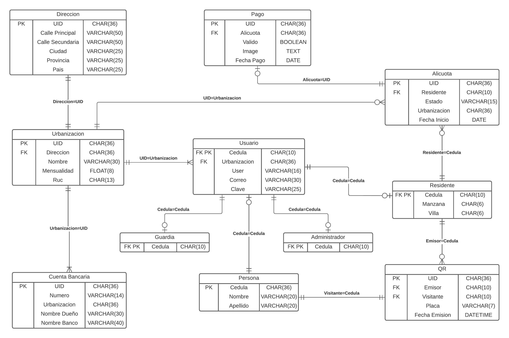

# UrbaPass Backend

## Tabla de Contenidos

1. [Descripción](#descripción)
2. [Uso](#uso)
3. [Esquema UrbaPassDB](#esquema-urbapassdb)
4. [Rutas](#rutas)
   * [Usuario](#usuario)
   * [Residente](#residente)
   * [Administrador](#administrador)
   * [Guardia](#guardia)
   * [Dirección](#dirección)
   * [Cuenta Bancaria](#cuenta-bancaria)
   * [Urbanización](#urbanización)
   * [Alicuota](#alicuota)
   * [Pago](#pago)
   * [QR](#qr)
   * [Token](#token)
5. [Generación de Datos](#generación-de-datos)
6. [Deprecated - Reconstrucción de Modelos](#deprecated---reconstrucción-de-modelos)
7. [Bugs](#bugs)
8. [Autor](#autor)

## Descripción

**UrbaPass Backend** es una API REST que permitirá la comunicación entre el cliente y servidor de Facturando, facilita la interación y obtención de los datos mediante peticiones con el protocolo HTTP.

## Uso

* Abrir un terminal de comandos en el directorio del proyecto.
* Usar el comando `npm install` para descargar todas las dependencias.
* [Crear la bd y generar datos](#generación-de-datos) para poder probar la API.
* Configurar el archivo `./config/config.json` con las credenciales para development y production en caso de ser necesario.
* Usar el comando `npm run devstart` para correr el proyecto.

## Esquema UrbaPassDB



## Rutas

La mayoría de los parámetros solicitados en ciertos métodos HTTP deben ser enviados mediante el body del requerimiento en formato JSON.

### Usuario

|Método|Ruta|Función|Parámetros|
|------|----|-------|----------|
|`get`|/usuario|Retorna todos los usuarios.|None|
|`get`|/usuario/:cedula|Retorna el usuario con la cédula dada.|None|
|`get`|/usuario/user/:user|Retorna el usuario con el user dado.|None|
|`get`|/usuario/correo/:correo|Retorna el usuario con el correo dado.|None|

### Residente

|Método|Ruta|Función|Parámetros|
|------|----|-------|----------|
|`get`|/residente|Retorna todos los residentes.|None|
|`post`|/residente|Añade un residente a la db.|`cedula` `nombre` `apellido` `urbano` `user` `correo` `clave` `manzana` `villa`|
|`get`|/residente/:cedula|Retorna el residente con la cédula dada.|None|
|`put`|/residente/:cedula|Actualiza el residente con la cédula dada en la db.|WIP|
|`delete`|/residente/:cedula|Elimina el residente con la cédula dada en la db.|None|

### Administrador

|Método|Ruta|Función|Parámetros|
|------|----|-------|----------|
|`get`|/administrador|Retorna todos los administradores.|None|
|`post`|/administrador|Añade un administrador a la bd.|WIP|
|`get`|/administrador/:cedula|Retorna el administrador con la cédula dada.|None|
|`put`|/administrador/:cedula|Actualiza el administrador con la cédula dada.|WIP|
|`delete`|/administrador/:cedula|Elimina el administrador con la cédula dada en la bd.|None|

### Guardia

|Método|Ruta|Función|Parámetros|
|------|----|-------|----------|
|`get`|/guardia|Retorna todos los guardias.|None|
|`post`|/guardia|Añade un guardia a la bd.|`cedula` `nombre` `apellido` `urbano` `user` `correo` `clave`|
|`get`|/guardia/:cedula|Retorna el guardia con la cédula dada.|None|
|`put`|/guardia/:cedula|Actualiza el guardia con la cédula dada.|WIP|
|`delete`|/guardia/:cedula|Elimina el guardia con la cédula dada en la bd.|None|

### Dirección

|Método|Ruta|Función|Parámetros|
|------|----|-------|----------|
|`get`|/direccion|Retorna todas las direcciones|None|
|`post`|/direccion|Añade una instancia de dirección a la bd.|`calle_principal` `calle_secundaria` `ciudad` `provincia` `pais`|

### Cuenta Bancaria

|Método|Ruta|Función|Parámetros|
|------|----|-------|----------|
|`get`|/cuenta|Retorna todas las cuentas bancarias.|None|
|`post`|/cuenta/:urbanizacion|Añade una cuenta bancaria asociada a la urbanización dada.|`numero` `nombre_dueno` `nombre_banco`|

### Urbanización

|Método|Ruta|Función|Parámetros|
|------|----|-------|----------|
|`get`|/urbanizacion|Retorna todas las urbanizaciones.|None|
|`post`|/urbanizacion|Añade una urbanización a la bd.|WIP|
|`get`|/urbanizacion/:uid|Retorna la urbanizacion con la uid dada.|None|
|`put`|/urbanizacion/:uid|Actualiza el urbanizacion con la uid dada.|WIP|
|`delete`|/urbanizacion/:uid|Elimina el urbanizacion con la uid dada en la bd.|None|

### Alicuota

|Método|Ruta|Función|Parámetros|
|------|----|-------|----------|
|`get`|/alicuota|Retorna todas las alicuotas.|None|
|`put`|/alicuota|Actualiza el estado de la alicuota.|WIP|
|`get`|/alicuota/:cedula|Retorna todas las alicuotas correspondiente al residente(cédula) dado.|None|
|`post`|/alicuota/:cedula|Añade una alicuota asociada al residente(cédula) dado.|WIP|


### Pago

El voucher debe ser enviado como una carga de archivo de imagen con encoding `multipart/form-data` y el name tag debe ser igual a `voucher`. Mirar `./public/views/testpost.html` para ver un ejemplo.

Las imagenes se almacenan en la carpeta `./public/uploads/` por lo tanto necesitas **crearla** en caso de no tenerla.

El imgsrc debe ser renderizado de la siguiente forma:

```html
;base64,<imgsrc>">

```

|Método|Ruta|Función|Parámetros|
|------|----|-------|----------|
|`get`|/pago|Retorna todos los pagos.|None|
|`get`|/pago/:alicuota|Retorna el pago asociado a la alícuota dada incluyendo el imgsrc para renderizar el comprobante|None|
|`post`|/pago/:alicuota|Añade un pago asociada a la alícuota dada.|`voucher`|
|`put`|/pago/:alicuota|Actualiza el pago asociado a la alícuota dada.|`valido`|

### QR

|Método|Ruta|Función|Parámetros|
|------|----|-------|----------|
|`get`|/qr|Retorna todos los QR.|None|
|`get`|/qr/:cedula|Retorna todos los QR creados por un residente(cédula) dado.|None|
|`post`|/qr/:cedula|Añade un QR asociado al residente(cédula) dado.|`visitante` `nombre` `apellido` `placa`|

### Token

|Método|Ruta|Función|Parámetros|
|------|----|-------|----------|
|`get`|/token/decode|Retorna la información decodificada del jwt token actual.|None|
|`post`|/token/login|Genera y guarda un jwt token.|`user` `clave`|

## Generación de Datos

Para generar el schema de la base de datos abre `./script-sql/create-schema.sql` en MySQL Workbench y ejecuta el código dentro.

Una vez tengas creada el *schema* de la base de datos **UrbaPassDB** generaremos datos de prueba para probar la API. Abre el archivo `./script-sql/insert-data.sql` en MySQL Workbench y ejecuta el código dentro. 

De esta manera se creará una cantidad moderada de datos de prueba. No olvides configurar el archivo `./config/config.json` con tus credenciales para poder conectarte a la base de datos.

## Deprecated - Reconstrucción de Modelos

Abre `./script-sql/create-schema.sql` en MySQL Workbench y ejecuta el código dentro. Esto creará la base de datos necesaria para los modelos en caso de no tenerlos en el proyecto.

Abre una terminal de comandos en el directorio del proyecto y ejecuta el siguiente comando:

```bash
sequelize-auto -h <host> -d <database> -u <user> -x <password> -p <port> -T <skiptables>
```

### Donde:

- Especifique el hostname después del parámetro -h \<host>. Generalmente **localhost**.
- Especifique el nombre de la base de datos después del parámetro -d \<database>. Reemplazar con el nombre de la base de datos **UrbaPassDB**.
- Especifique el nombre del usuario después del parámetro -u \<user>. Reemplazar con su **usuario para la conexión MySQL**.
- Especifique la contraseña del usuario después del parámetro -x \<password>. Reemplazar con su **contraseña para la conexión MySQL**.
- Especifique el puerto después del parámetro -p \<port>. Generalmente **3306**.
- Especifique las tablas a omitir después del parámetro -T \<skiptables>. Reemplazar con **sequelizemeta**.

## Bugs

## Autor

- [Jonathan García](https://github.com/ElPitagoras14)